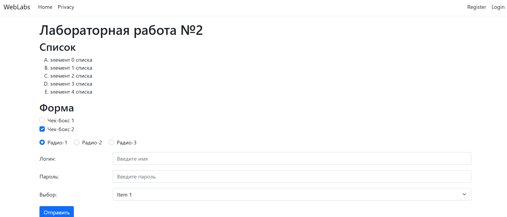

## Лабораторная работа 2
Цель работы.
Знакомство с языком Razor. Знакомство механизмами
структурирования проекта

## 🔧 Технологии

- HTML5
- Bootstrap 5 (подключены как `.css`, так и `.js`)
- Font Awesome
- jQuery (подключён, но пока не используется)
- Собственные стили (`site.css`)

